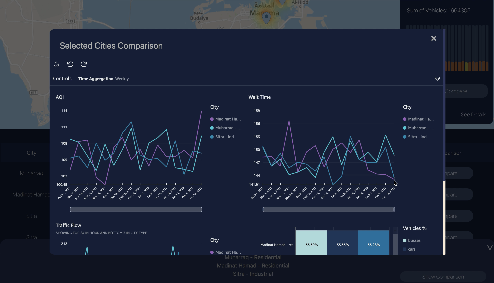

# MAQIAS - DASHBOARD

## Date: 25/05/22

## Version: 1.0

## By: Yasmeen Albalooshi & Zakeya AlSaeed

### MAQIAS is a dashboard to display, monitor, and analyze the traffic air pollution across different cities in Bahrain measured using Air Quality Index (AQI).

---

## Technologies used

- Django
- HTML
- CSS
- Javascript
- Amazon Web Services
- VS Code

---

## Project Screenshots

#### Sign In Page

#### Time range selection

#### Map indicating AQI over different cities

#### Summary of cities details

#### Sensors display on zoom in

#### Side panel showing location information on click of pin

#### Details of city on-click of side panel 'see details'

#### Comparison of selected cities

